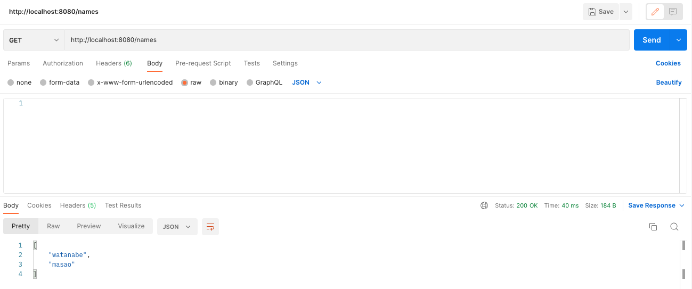
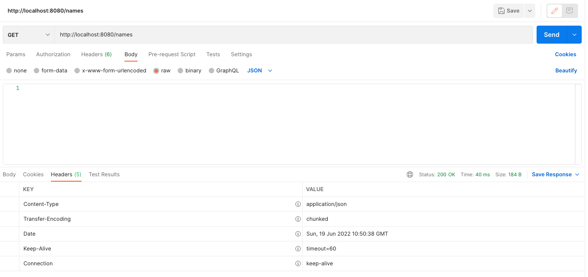
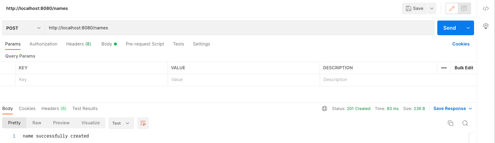
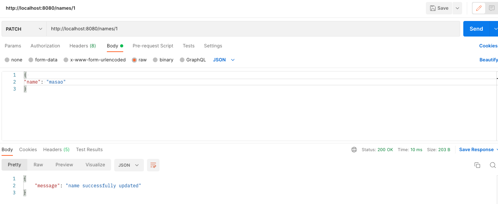
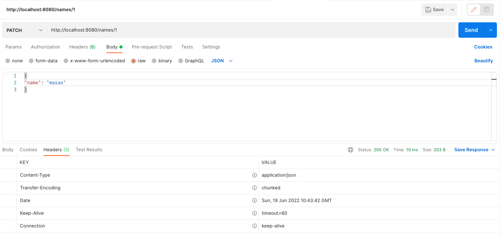
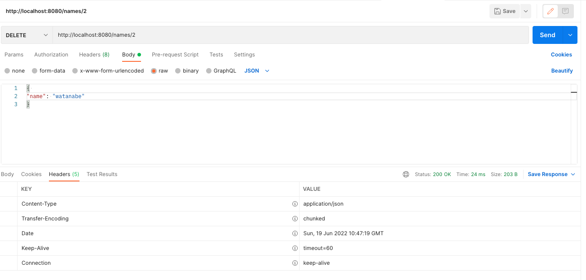
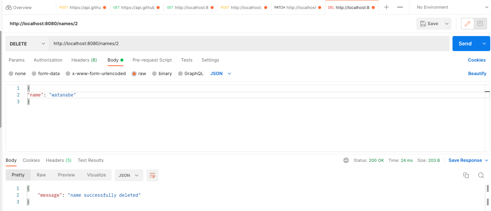
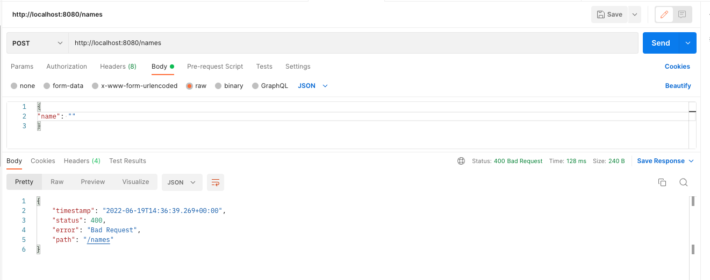

# 課題 7  

## 課題内容
HTTPメソッドのGET/POST/PATCH/DELETEのリクエストを扱えるControllerを実装  

## 出力結果  
### GET  

  
### POST  

  
### PATCH

  
### DELETE  

 

## 追加
### バリデーション機能  
依存関係に  
**implementation 'org.springframework.boot:spring-boot-starter-validation'**
を追加  
DeleteControllerTest  
PatchControllerTest  
PostControllerTest  
の各種ハンドラーメソットに@Validatedを追加し、各種対応するformのメンバ変数に **@NotBlank**を指定  
空文字の場合はエラーとする設定を行う  

## 出力結果

  

## その他バリデーションの検証結果  
### @NotBlank
空文字  通らない  
半角スペース  通らない  
全角スペース. 通る  
ステータス指定無し 通らない  
### @NotNull  
全角スペース. 通る  
全角スペース. 通る  
ステータス指定無し 通らない  
### @Length(min=(最低文字数), max=(最大文字数))  
min=0の場合　空文字通る  
min=1の場合　空文字通らない  

max=5とした場合  
半角5文字　通る  
全角5文字　通る  
ステータス指定なし　通る  
6文字以上は通らない  
